<!-- page_number: true -->

# 第2回 Pymee

---

# 事前準備確認

+ Pythonのインストール
+ テキストエディタのインストール(vi, vimでも可)
+ 勉強資料のダウンロード


# 参加にあたっての注意事項
+ 私用PCは執務室で使用しないで下さい
+ zoom配信を行いますのでご了承下さい
+ 不明点は気軽に聞いて下さい！

---

# 今日の内容

1. フローチャートとアルゴリズム
1. 前回のおさらい
1. 違う方法でやってみよう(辞書)
1. おみくじに仕事運を追加しよう(辞書とリスト)
1. 「結果」によってメッセージを出力しよう(in)

---

# プログラミングって？
+ コンピュータにやってもらい処理を書いて指示する事
+ プログラム：指示内容を書いたもの
+ プログラミング言語：指示内容を記述するための言語
    - python, java, C, Rubyなどなど
    - Python2とPython3があり2は廃止予定
+ 実行環境：プログラムを実行する環境
    - インタプリタ
    - コンパイラ
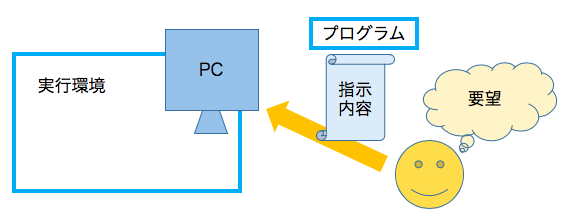

---

# プログラムの実行方法
1. ファイルを作成して実行
2. インタプリタの対話モード

---

# ファイルを作成して実行
プログラムの実行方法は下記の通りです
1. 処理内容を書いたファイルを作成
    この際にファイルのパスをメモします
     **注意：ファイルの文字コードはutf-8で保存します！**
2. windowsの場合はコンソールへ、Macの場合はターミナルを起動
3. 処理内容を書いたファイルのフォルダへ移動
    ```
    cd <項番1で確認したフォルダのパス>
    ```
---

# ファイルを作成して実行

4. 下記コマンドをコンソールもしくはターミナルに入力しプログラムを実行
    + windowsの場合
    ```
    py ファイル名.py
    ```
    + その他の場合
    ```
    python3 ファイル名.py
    ```
Python3を使用していることを意識するため、以降のスライドではファイル実行時のコマンドを **「python3 ファイル名.py」** とします。

---

# インタプリタの対話モード
+ 対話モードとは？
    + コードを読み取りつつ、実行することが可能
+ 使い方
    + 対話モードの起動
        - windowsの場合「py」と入力
        - それ以外は「python3.6」と入力
    + プロンプトが「>>>」となることを確認
    + そのまま実施したい処理を入力する
    + 対話モードを終了するときは「Ctrl」と「D」を同時に押下、もしくは「quit()」と入力

---

# 前回の復習
```
# 代入
omikuji_1 = '大吉 すべてよし'
omikuji_2 = '中吉 まあまあよし'
omikuji_3 = '小吉 よし'
omikuji_4 = '吉 すこしよし'
omikuji_5 = '凶 わるし'

# unseiにomikuji_1を代入
unsei = omikuji_1

print('あなたの名前を入力してください')

# 名前を入力
name = input('>>')

# 結果を出力
print(name + 'さんの運勢は、' + unsei + 'です!')
```

---

# 型とは

+ 型はデータの箱、データの種類によって箱の種類が異なる


---

# 型とは

+ 扱うデータの種類

データ型 | 具体例
--- | ---
文字列 | こんにちは、名前、pymee
数値 | 1, 100, 80
浮動小数点数 | 1.09, 20.59
Boolean | True, False

+ Pythonでは自動で判別のため、データ型の宣言は不要

---

# 型とは

```
# 代入
omikuji_1 = '大吉 すべてよし'
omikuji_2 = '中吉 まあまあよし'
omikuji_3 = '小吉 よし'
omikuji_4 = '吉 すこしよし'
omikuji_5 = '凶 わるし'

# unseiにomikuji_1を代入
unsei = omikuji_1

```
'大吉 すべてよし'のデータの型は文字列となる

---

# 変数とは？
+ 値が入っている箱につけたラベル
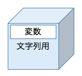

---

# 変数とは？

```
# 代入
omikuji_1 = '大吉 すべてよし'
omikuji_2 = '中吉 まあまあよし'
omikuji_3 = '小吉 よし'
omikuji_4 = '吉 すこしよし'
omikuji_5 = '凶 わるし'

# unseiにomikuji_1を代入
unsei = omikuji_1

```

+ omikuji_1、omikuji_2 ...が変数
```
 変数 = 変数に格納するデータ(変数でも可能)
```
---

# 関数とは？
+ 特定の機能(与えた文字を出力する)を持つプログラムの塊


---

# 出力

```
print('あなたの名前を入力してください')
```
| print()関数| |
|:--- | --- |
| 機能 | 引数のデータを出力する  |
| 引数 | 'あなたの名前を入力してください'|
| 戻り値| なし|

+ 実行例

```
>>> print('あなたの名前を入力してください')
あなたの名前を入力してください
```
---

# 出力

+ 変数と文字列を +  で結合することが可能

```
# 結果を出力
print(name + 'さんの運勢は、' + unsei + 'です!')
```
---

# 入力

```
# 名前を入力
name = input('>>')
```
| input()関数| |
|:--- | --- |
| 機能 | コンソールに入力されたデータを取り込む  |
| 引数 | 実行時に表示されるデータ|
| 戻り値| 入力されたデータ|


+ 実行例(インタプリタの会話モードで実行)

```
>>> name = input('>>')
>>pymee
>>>
>>> name
'pymee'
```

---

# プログラムの改良

+ ランダムでおみくじを選択し表示する

---

# 条件分岐

+ 条件によって処理内容を変える場合に使用する
    - ifからコロン(:)の部分が条件
    - スペース4つから始まっている部分が処理
    - elif:, else:で処理を続けることが可能
```
# numに格納された数字によって出力される文字列を変更
if num == 0:
	unsei = omikuji_1
elif num == 1:
	unsei = omikuji_2
elif num == 2:
	unsei = omikuji_3
elif num == 3:
	unsei = omikuji_4
elif num == 4:
	unsei = omikuji_5
else:
	unsei = ""
```

---

# 条件分岐

+ フローチャートの場合


---

# プログラムの改良
+ 変数が増えた場合のことを考慮しリストを使用

---

# リストとは？

+ リストは複数のデータの箱を1つの大きな箱にまとめる
+ 大きな箱の中に、0から始まる番号が振られている複数の小箱がある
+ 小箱の中に値が代入されている


---

# リストとは？

+ 振られた番号を元に小箱の値を取り出すことが可能


---

# リストとは？
+ リストの定義
```
# リスト(omikuji)を作成
omikuji = ['大吉 すべてよし',
		   '中吉 まあまあよし',
		   '小吉 よし',
		   '吉 すこしよし',
		   '凶 わるし',
		   ]
```
+ リストの取り出し
```
>>> omikuji[0]
'大吉 すべてよし'
```

---

# 前回のプログラム

```
# モジュールをインポート
import random

# リスト(omikuji)を作成
omikuji = ['大吉 すべてよし',
		   '中吉 まあまあよし',
		   '小吉 よし',
		   '吉 すこしよし',
		   '凶 わるし',
		   ]

#ランダムでおみくじを表示
unsei = random.choice(omikuji)

print('あなたの名前を入力してください')

# 名前を入力
name = input('>>')

# 結果を出力
print(name + 'さんの運勢は、' + unsei + 'です!')

```
---

# フローチャート

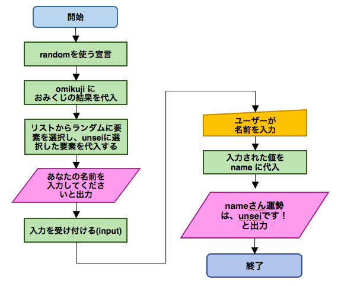

---

# 今日の内容

1. フローチャートとアルゴリズム
1. 前回のおさらい
1. 違う方法でやってみよう(辞書)
1. おみくじに仕事運を追加しよう(辞書とリスト)
1. 「結果」によってメッセージを出力しよう(in)

---

# 違う方法でやってみよう
+ 辞書を使っておみくじプログラムを改良してみよう！

---

# 辞書とは？
+ 鍵と値で定義する
+ 「:」より左側が鍵の名前で、右側が鍵名に対応する値を示している
+ 鍵を元に値を取り出すのでリストと異なり値の順番は関係ない
+ 鍵は重複不可


---

# 辞書とは？

+ 定義方法
> 辞書名 = {鍵 : 値, 鍵 : 値, 鍵 : 値, ...}

```
omikuji = {'daikichi': '大吉',
           'chukichi': '中吉',
           'shokichi': '小吉',
           'kichi': '吉',
           'kyo': '凶'}
```


---

# 辞書とは？

+ リストのようにオフセットではなく、鍵名を使用して値を取り出す
```
>>> omikuji['daikichi']
'大吉'
```


---

# 対話モードで動作確認をしてみよう！
+ 辞書の定義
    > 変数名 = {鍵:値, 鍵:値, 鍵:値,...}

    - ２行目以降の先頭のスペースは見やすくするために入力しています
```
>>> omikuji = {'daikichi': '大吉',
...            'chukichi': '大吉',
...            'shokichi': '小吉',
...            'kyo': '凶'}
```
+ 「omikuji」の確認
    - 「omikuji」と入力して値を確認する
```
>>> omikuji
{'daikichi': '大吉', 'chukichi': '大吉',
 'shokichi': '小吉', 'kyo': '凶'}
```

---

# 対話モードで動作確認をしてみよう！
+ 鍵を使用しての値の取り出し
    > 変数名[鍵]

    - 鍵が「daikichi」の値を取り出す
    - 鍵を指定する際は、<u>[ ]を使用することに注意!!</u>
```
>>> omikuji['daikichi']
'大吉'
```
---

# 対話モードで動作確認をしてみよう！

+ 値と鍵の追加
    > 変数名[鍵] = 値

    - 鍵が「kichi」、値が「吉」の要素を追加する
```
>>> omikuji['kichi'] = "吉"
```
+ 追加されていることを確認
```
>>> omikuji
{'daikichi': '大吉', 'chukichi': '大吉',
 'shokichi': '小吉', 'kyo': '凶', 'kichi': '吉'}
```

---

# 対話モードで動作確認をしてみよう！

+ 値の変更
    > 変数名[鍵] = 値

    - 鍵「chukichi」の値を「中吉」に変更する
```
>>> omikuji['chukichi'] = '中吉'
```
+ 変更されていることを確認
```
>>> omikuji
{'daikichi': '大吉', 'chukichi': '中吉',
 'shokichi': '小吉', 'kyo': '凶', 'kichi': '吉'}
```
---

# 対話モードで動作確認をしてみよう！

+ 値と鍵の削除
    > del 変数名[鍵]

    + 鍵が「kyo」の値を削除する
```
>>> del omikuji['kyo']
```
+ 削除されていることを確認
```
>>> omikuji
{'daikichi': '大吉', 'chukichi': '中吉',
 'shokichi': '小吉', 'kichi': '吉'}
```

---

# 対話モードで動作確認をしてみよう！
+ 鍵だけの取り出し
    > 変数名.keys()

    + dict_keysという型で出力される
```
>>> omikuji.keys()
dict_keys(['daikichi', 'chukichi', 'shokichi', 'kichi'])
```

+ 値だけ取り出し
    > 変数名.values()

    + dict_valuesという型で出力される
```
>>> omikuji.values()
dict_values(['大吉', '中吉', '小吉', '吉'])
```

---

# 対話モードで動作確認をしてみよう！
+ 鍵と値を取り出し
    > 変数名.items()

    + dict_itemsという型で出力される
```
>>> omikuji.items()
dict_items([('daikichi', '大吉'), ('chukichi', '中吉'),
('shokichi', '小吉'), ('kichi', '吉')])
```
---

# おみくじプログラムの改良
1. リストを辞書に書き換える
2. random.choice(list)の()の中身を辞書から取り出した鍵にする

---

# ファイルのコピー
1. ファイル「04-2_list.py」をコピーし、ファイル名を「05_dict.py」にする
2. ファイル名「05_dict.py」を開く

---

# 修正箇所
+ 左が修正後、右が修正前のコード


---

# プログラムの実行
3. 下記コマンドをコンソールもしくはターミナルに入力しプログラムを実行
+ windowsの場合
```
py 05_dict.py
```
+ その他の場合
```
python3 05_dict.py
```
4. 実行結果
```
$ python3 05_dict.py
あなたの名前を入力してください
>>pymee
pymeeさんの運勢は、大吉 すべてよしです!
```
---

# フローチャート

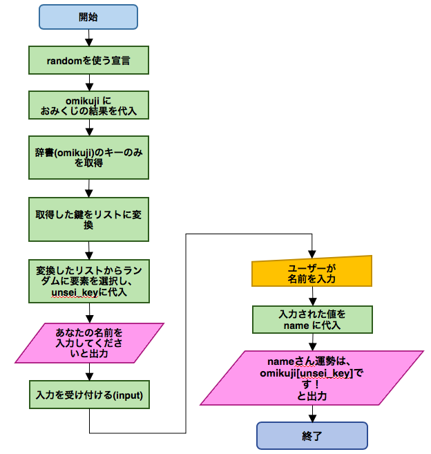

---

# リストの部分を辞書に書き換える

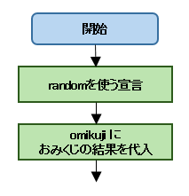

```
omikuji = {'daikichi': '大吉 すべてよし',
           'chukichi': '中吉 まあまあよし',
           'shokichi': '小吉 よし',
           'kichi': '吉 少しよし',
           'kyo': '凶 わるし'
}
```

---


# 変数「unsei」を「unsei_key」に書き換える


<font style = "font-size: 80%">

```
#辞書(omikuji)のkeyをランダム取得し、unsei_keyに代入
# random.choiceするには、list化が必須のため、list()をしてます。
unsei_key = random.choice(list(omikuji.keys()))
```
</font>

---

# リストを辞書に書き換える
> list()

+ リストに変換する
```
>>> omikuji.keys()
dict_keys(['daikichi', 'cyukichi', 'syoukichi', 'kichi',
            'kyo'])
>>>
>>> list(omikuji.keys())
['daikichi', 'cyukichi', 'syoukichi', 'kichi', 'kyo']
```

---

# 出力結果を書き換える


```
print(name + 'さんの運勢は、' + omikuji[unsei_key] + 'です!')
```

---

# 完成コード(1/2)
```
# モジュールをインポート
import random

omikuji = {'daikichi': '大吉 すべてよし',
           'chukichi': '中吉 まあまあよし',
           'shokichi': '小吉 よし',
           'kichi': '吉 少しよし',
           'kyo': '凶 わるし'
}

```

---

# 完成コード(2/2)
```
#辞書(omikuji)のkeyをランダム取得し、unsei_keyに代入
# random.choiceするには、list化が必須のため、list()をしてます。
unsei_key = random.choice(list(omikuji.keys()))

print('あなたの名前を入力してください')

# 名前を入力
name = input('>>')

# 結果を出力
print(name + 'さんの運勢は、' + omikuji[unsei_key] +'です!')
```

---

# まとめ
+ 辞書とは
    + {鍵 : 値}の形で定義し、鍵を使用して値を取り出す
    + リストと異なり鍵を使用して値を取り出すため順番は関係ない

---

# 今日の内容

1. フローチャートとアルゴリズム
1. 前回のおさらい
1. 違う方法でやってみよう(辞書)
1. おみくじに仕事運を追加しよう(辞書とリスト)
1. 「結果」によってメッセージを出力しよう(in)

---

# おみくじに仕事運を追加しよう
+ 今までは「大吉」や「中吉」といった全体運だけ
+ このおみくじに「仕事運」の項目を追加する

---

# おみくじに仕事運を追加しよう

+ リストの値を辞書にする
リストの中に辞書を入れる、辞書の値をリストにすることも可能
> 変数名 = [ {鍵:値}, {鍵:値}, {鍵:値},...]
```
omikuji = [
 {'all':全体運の内容0,'work':仕事運の内容0},
 {'all':全体運の内容1,'work':仕事運の内容1},...]
```


---

# 値が辞書の場合
+ 値の構造について

> omikuji = \[
>  {'all':全体運の内容0,'work':仕事運の内容0}, **←omikuji[0]**
>  {'all':全体運の内容1,'work':仕事運の内容1}, **←omikuji[1]**
>  ...]

{'all':hogehoge,'work':hogehoge}という辞書がomikuji(リスト)の1つの値になっている


---

# 値が辞書の場合

+ 値の取り出し
    - 辞書1つを取り出す場合はリストと同様にオフセットを指定する

  ```
    >>> omikuji[0]
    {'all': '全体運の内容0', 'work': '仕事運の内容0'}
  ```


---

# 値が辞書の場合
+ 値の取り出し
    - 辞書の値を取り出す場合はオフセットによって取り出した値の鍵を指定する
    ```
    >>> omikuji[0]['all']
    '全体運の内容0'
    ```
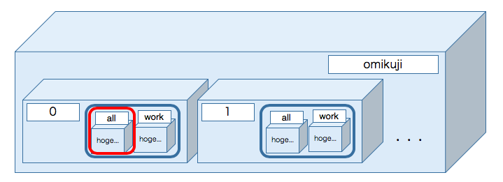

---

# おみくじプログラムの改良
+ 変数「omikuji」の値に「仕事運」の項目を追加する
+ 変数を要素が辞書型のリストとする
+ おみくじ結果は要素が辞書のリストからランダムで要素を選択する
+ 選択した要素を鍵を使用して出力する

---

# 変数「omikuji」の値に「仕事運」の項目を追加する
1. ファイル「05_dict.py」をコピーし、ファイル名を「06_nest.py」にする
2. ファイル名「06_nest.py」を開く

---

# 修正箇所
+ 左が修正後、右が修正前のコード

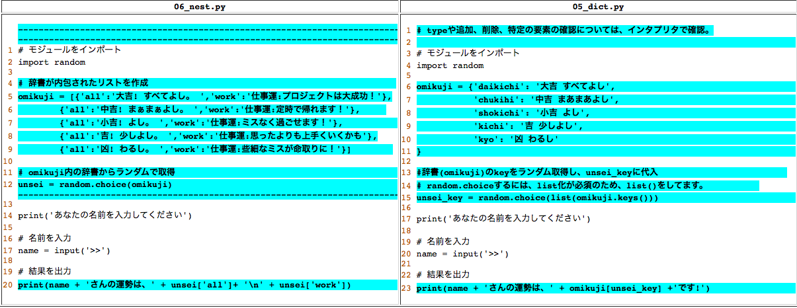

---


# プログラムの実行
3. 下記コマンドをコンソールもしくはターミナルに入力しプログラムを実行
+ windowsの場合
```
py 06_nest.py
```
+ その他の場合
```
python3 06_nest.py
```
4. 実行結果
```
$ python3 06_nest.py
あなたの名前を入力してください
>>pymee
pymeeさんの運勢は、大吉! すべてよし。
仕事運:プロジェクトは大成功
```

---

# フローチャート

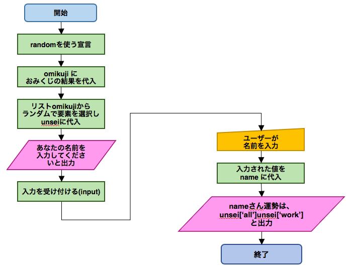

---


# 変数「omikuji」の修正

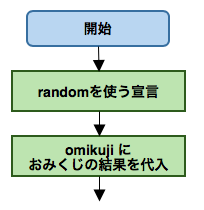

<font style = "font-size: 80%">

```
# 辞書が内包されたリストを作成
omikuji = [
 {'all':'大吉! すべてよし。 ','work':'仕事運:プロジェクトは大成功！'},
 {'all':'中吉! まぁまぁよし。 ','work':'仕事運:定時で帰れます！'},
 {'all':'小吉! よし。 ','work':'仕事運:ミスなく過ごせます！'},
 {'all':'吉! 少しよし。 ','work':'仕事運:思ったよりも上手くいくかも'},
 {'all':'凶! わるし。 ','work':'仕事運:些細なミスが命取りに！'}]
```
</font>

---

# リストomikujiからランダムで要素を取得


```
# omikuji内の辞書からランダムで取得
unsei = random.choice(omikuji)
```

---

# 出力結果の修正

<font style = "font-size: 80%">


```
# 結果を出力
print(name + 'さんの運勢は、' + unsei['all']+ '\n' + unsei['work'])
```
+ \n は改行を示している
</font>

---

# 完成コード(1/2)
<font style = "font-size: 80%">

```
# モジュールをインポート
import random

# 辞書が内包されたリストを作成
omikuji = [
 {'all':'大吉! すべてよし。 ','work':'仕事運:プロジェクトは大成功！'},
 {'all':'中吉! まぁまぁよし。 ','work':'仕事運:定時で帰れます！'},
 {'all':'小吉! よし。 ','work':'仕事運:ミスなく過ごせます！'},
 {'all':'吉! 少しよし。 ','work':'仕事運:思ったよりも上手くいくかも'},
 {'all':'凶! わるし。 ','work':'仕事運:些細なミスが命取りに！'}]

# omikuji内の辞書からランダムで取得
unsei = random.choice(omikuji)
```
</font>

---

# 完成コード(2/2)
<font style = "font-size : 80%">

```
print('あなたの名前を入力してください')

# 名前を入力
name = input('>>')

# 結果を出力
print(name + 'さんの運勢は、' + unsei['all']+ '\n' + unsei['work'])
```
</font>

---

# 動作を確認しよう！
+ unseiの値をprintで取り出してみよう！
<font style = "font-size: 80%">

```
# モジュールをインポート
import random

# 辞書が内包されたリストを作成
omikuji = [
 {'all':'大吉! すべてよし。 ','work':'仕事運:プロジェクトは大成功！'},
 {'all':'中吉! まぁまぁよし。 ','work':'仕事運:定時で帰れます！'},
 {'all':'小吉! よし。 ','work':'仕事運:ミスなく過ごせます！'},
 {'all':'吉! 少しよし。 ','work':'仕事運:思ったよりも上手くいくかも'},
 {'all':'凶! わるし。 ','work':'仕事運:些細なミスが命取りに！'}]

# omikuji内の辞書からランダムで取得
unsei = random.choice(omikuji)

# unseiの値を確認
print(unsei)
```
</font>

---

# 動作結果
+ 「unseiの値を確認」を追加し実行すると。。。
    ※windowsの場合は「py 06_nest_test.py」と入力して実行

<font style = "font-size: 80%">

```
$ python3 06_nest_test.py
{'all': '大吉! すべてよし。 ', 'work': '仕事運:プロジェクトは大成功！'}
あなたの名前を入力してください
>>pymee
pymeeさんの運勢は、大吉! すべてよし。
仕事運:プロジェクトは大成功！
```
</font>

+ { }なので出力された値が辞書であること
+ 結果を出力させる最後のprint()のunsei['all']、unsei['work']と、unseiの確認で追加したprint()によって出力された結果の対応を確認
<font style = "font-size: 80%">

> \# 結果を出力
> print(name + 'さんの運勢は、' + unsei['all']+ '\n' + unsei['work'])

</font>

---

# 確認部分の削除
+ 確認が終わったので、追加した「unseiの値を確認」部分を削除する

```
# unseiの値を確認
print(unsei)
```

---

# まとめ
+ リストの要素を辞書にしたり、辞書の要素をリストにすることが可能

---

# 今日の内容

1. フローチャートとアルゴリズム
1. 前回のおさらい
1. 違う方法でやってみよう(辞書)
1. おみくじに仕事運を追加しよう(辞書とリスト)
1. 「結果」によってメッセージを出力しよう(in)

---

# おみくじ結果によってメッセージを出力する
+ 全体運に「吉」が含まれていた場合は「いい一日になるといいですね！」と出力する
+ 全体運が含まれていない場合は、「こういう日もあります。元気出してください！！」と出力する

---

# おみくじ結果によってメッセージを出力する
+ ifを使用して処理内容を変える
    + 全体運に「吉」が含まれていた場合は(条件)「いい一日になるといいですね！」と出力する(処理)
+ 文字列にある文字が含まれているかを確認するには「in」を使用する
    + '吉' in '大吉'
        + 一致する(true)
    + '吉' in '凶'
        + 一致しない(false)

---

# おみくじプログラムを改良する
1. ファイル「06_nest.py」をコピーし、ファイル名を「07_if_in.py」にする
2. ファイル名「07_if_in.py」を開く

---

# 修正箇所
3. 水色の部分を修正

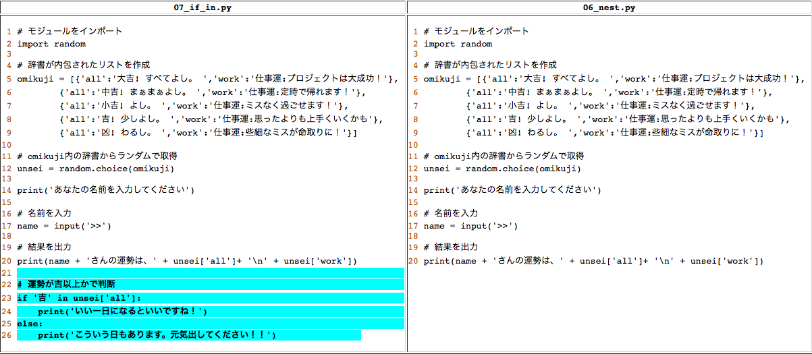

---

# プログラムの実行
4. 下記コマンドをコンソールもしくはターミナルに入力しプログラムを実行
+ windowsの場合
```
py 07_if_in.py
```
+ その他の場合
```
python3 07_if_in.py
```
5. 実行結果
```
$ python3 07_if_in.py
あなたの名前を入力してください
>>pymee
pymeeさんの運勢は、大吉! すべてよし。
仕事運:プロジェクトは大成功！
いい一日になるといいですね！
```

---

# フローチャート

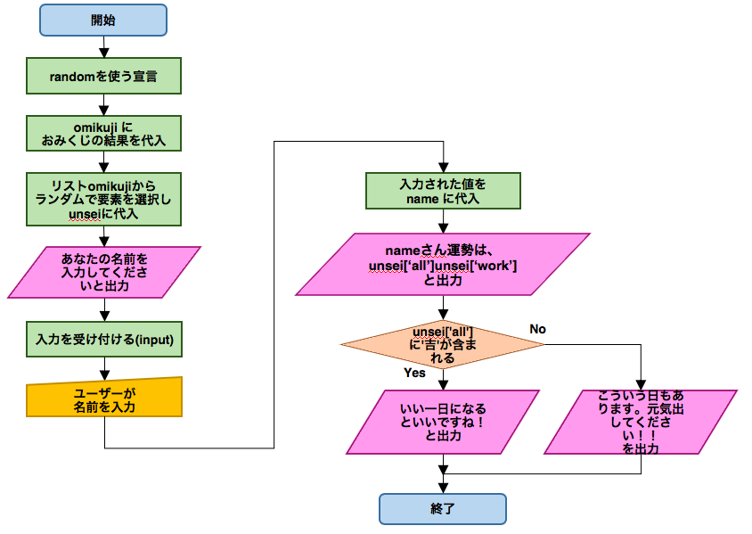

---


# 復習！
+ ifって？
条件1に合う場合(真,True)は処理１を実行、条件1に合わない場合(偽,Flase)はelse後の処理2を実行する(elifやelseは省略可能)
<font style = "font-size: 80%">
```
if 条件1:
    処理1
else:
  処理2
```
</font>

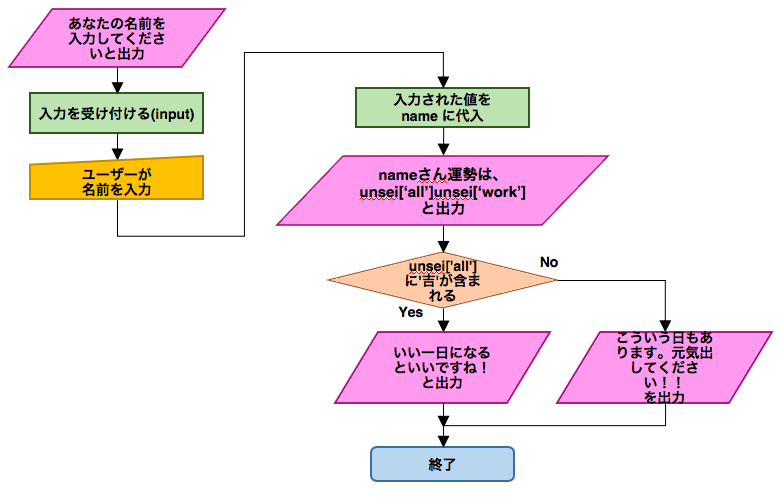

---

# 完成プログラム(1/2)
<font style = "font-size: 80%">

```
# モジュールをインポート
import random

# 辞書が内包されたリストを作成
omikuji = [
 {'all':'大吉! すべてよし。 ','work':'仕事運:プロジェクトは大成功！'},
 {'all':'中吉! まぁまぁよし。 ','work':'仕事運:定時で帰れます！'},
 {'all':'小吉! よし。 ','work':'仕事運:ミスなく過ごせます！'},
 {'all':'吉! 少しよし。 ','work':'仕事運:思ったよりも上手くいくかも'},
 {'all':'凶! わるし。 ','work':'仕事運:些細なミスが命取りに！'}]

# omikuji内の辞書からランダムで取得
unsei = random.choice(omikuji)
```

</font>

---

# 完成プログラム(2/2)
<font style = "font-size: 80%">

```
print('あなたの名前を入力してください')

# 名前を入力
name = input('>>')

# 結果を出力
print(name + 'さんの運勢は、' + unsei['all']+ '\n' + unsei['work'])

# 運勢が吉以上かで判断
if '吉' in unsei['all']:
    print('いい一日になるといいですね！')
else:
    print('こういう日もあります。元気出してください！！')
```

</font>

---

# まとめ
+ 「in」は「〜を含んでいる」という比較演算子

---

# 今日の内容振り返り

1. フローチャートとアルゴリズム
1. 前回のおさらい
1. 違う方法でやってみよう(辞書)
1. おみくじに仕事運を追加しよう(辞書とリスト)
1. 「結果」によってメッセージを出力しよう(in)

みなさん長い間お疲れ様でした！

---

# 最後に
+ 次回予告
おみくじ内容をファイルから読み込んだり、書き込んだりするかも？

---

# アンケート
+ 今後のよりよい活動のため、アンケートにご協力ください！<br>
<br>
https://questant.jp/q/EHD95UUV

---

# ご質問など。。。
+ tocaroグループにて、疑問、不明点を気軽に聞いてください！
