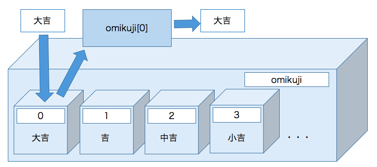
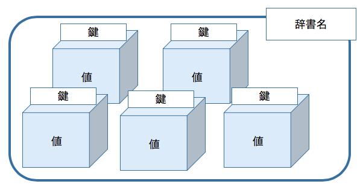

<!-- page_number: true -->

# 第3回 Pymee

---

# 事前準備確認

+ Pythonのインストール
+ テキストエディタのインストール(vi, vimでも可)
+ 勉強資料のダウンロード


# 参加にあたっての注意事項
+ 私用PCは執務室で使用しないで下さい
+ zoom配信を行いますのでご了承下さい
  + 今回から録画も行います
+ 不明点は気軽に聞いて下さい！

---

# 今日の内容

1. 前回のおさらい(リスト/辞書型)
1. for文
1. ファイル読み込み
1. 例外

---

今回の講義は前回までの講義を踏まえた上で実施します。  

【今回の講義で利用する知識】
+ 変数
+ 関数
+ リスト
+ 辞書型

---
# 前回のおさらい

前回学んだコードをおさらいしましょう。

---

# リスト
```
#! python3

# リスト(omikuji)を作成
# omikujiという名前の変数にリスト型で一つずつ値を格納している。
omikuji = ['大吉 すべてよし',
           '中吉 まあまあよし',
           '小吉 よし',
           '吉 すこしよし',
           '凶 わるし',
           ]
print(omikuji[0])
```
+ 出力結果
```
大吉 すべてよし
```
---
+ omikujiという名前の大きな箱に0から順番に番号の付けられた小さな箱が格納されているイメージ  

---
# 辞書型
```
#! python3

# 辞書(omikuji)を作成
# omikujiという名前の変数に辞書型で一組ずつ「キー：値」の形で格納している。
omikuji = {"大吉":"すべてよし",
           "中吉":"まあまあよし",
           "小吉":"よし",
           "吉":"すこしよし",
           "凶":"わるし",
           }
print(omikuji["大吉"])
```
+ 出力結果
```
すべてよし
```
---
+ それぞれの値が格納された箱を開ける鍵を指定するイメージ  

---
# 思い出せましたか？この知識を前提に、本日の講義を行います。
---
# for文とは？
for文はリストから値を取得して、先頭から１つずつ値を取り出しながら繰り返し(ループ)処理を実装する事ができます。  

+ フローの画像(for文)

---
【例文(for文)】
```
#! python3

#「sample」という名前のリストを作成
sample = [1,2,3,4,5]

#for文で「sample」の中身を一つずつ取り出してループ
#先頭から取り出して末尾までループする。
for s in sample:
    print(s)
```
+ 出力結果
```
1
2
3
4
5
```
---
記載した通り、for文はリストから値を取得する事が前提の作りになっています。
ですが、以下のRange関数を併用する事とリストの準備なしで指定した回数だけループできます。

【例文(for文+Range関数)】
```
#! python3

#range(数字)で0～(記載した数字-1)までの数字が入ったリストが作れる。
#下記の例文だと0～9の値が入ったリストが作られる。
for s in range(10):
    print(s+1)
```
+ 出力結果
```
1
2
3
4
5
6
7
8
9
10
```

※10回ループしますが、出力は0から始まるので出力される値が0～9になります。その為、出力時の記載をs+1にして1～10を表示しています。  
※考え方としては「0から数字を10個並べたリストが作成される」  

---
## サンプルプログラムを作ってみましょう(for文)  

【事前準備】

デスクトップ(どこでもいいです)に作業フォルダを作成し、そこへ以下の名前でテキストファイルを作成して下さい。作成したファイルにサンプルプログラムを記載して保存して下さい。  
※全部コピペで張ってしまってOKです。

+ ファイル名

```
01_for.py
```
【サンプルプログラム】

```
#! python3

#「omikuji」というリストを作成
omikuji = ['仕事運 まあまあよし',
           '恋愛運 よし',
           '健康運 すこしよし'
           ]

#for文で「omikuji」の中身を一つずつ取り出してループ
#先頭から取り出して末尾までループする。
for o in omikuji:
    print(o)
```
---
コードが書けたら以下のコマンドで実行してみましょう。
+ 実行(windowsの場合)

```
py 02_fileIO.py
```
+ 実行(その他の場合)

```
python3 02_fileIO.py
```
+ 出力結果
```
仕事運 まあまあよし
恋愛運 よし
健康運 すこしよし
```
---
# ファイルから文字列を読み込んでみよう

現場でpythonを利用するのであれば、ファイル入出力は避けて通れない道です。
まずはファイルから文字を読み込んでみましょう。  
※今後「IO」と言う単語が出てきますが、「INPUT/OUTPUT」の略称で「入力(読み込み)/出力(表示)」を指しています。  
+ フローの画像(ファイルIO)

---
【例文(ファイルIO)】

```
#! python3

#読み込むファイルを指定。
#この書式で記載すると以下の通りに値が格納される。
#　・ファイル読み込み元：outputSample.txt
#　・ファイルから読み込んだ中身の格納先：output(一行ずつリスト形式で格納される)
output = open("outputSample.txt", "r",encoding="utf-8")

#ファイルから読み込んだ中身を一行ずつfor文で出力する。
for o in output:
    print (o);

#ファイルを読み込んだ後はクローズ処理を記載する。
#これを書かないとメモリにゴミが残る。(動作が重くなっていく)
output.close()
```
+ 出力結果
```
【大吉】
待人：辛抱強く待つべし
失物：足元にあり
恋愛：深入りするな
転居：無理せず待て
```

上記の文法で、ソースコード(.pyファイル)を配置したフォルダと同じフォルダに配置された「outputSample.txt」を読み込む事ができます。

---
## サンプルプログラムを作ってみましょう(ファイル読み込み)
【事前準備】

事前準備として、以下の内容を記載したテキストファイルを作業フォルダに保存しておいて下さい。

+ ファイル名

```
outputSample.txt
```
+ 記載内容

```
【大吉】
待人：辛抱強く待つべし
失物：足元にあり
恋愛：深入りするな
転居：無理せず待て
```
---

+ ファイル名

```
02_fileIO.py
```
【サンプルプログラム】

```
#! python3

#読み込むファイルを指定。
#ファイル読み込み元：outputSample.txt
output = open("outputSample.txt", "r",encoding="utf-8")

for o in output:
    print (o);

output.close()
```
+ 実行(windowsの場合)

```
py 02_fileIO.py
```
+ 実行(その他の場合)

```
python3 02_fileIO.py
```
+ 出力結果
```
【大吉】
待人：辛抱強く待つべし
失物：足元にあり
恋愛：深入りするな
転居：無理せず待て
```

ソースコードに直接記載されていた内容がテキストファイルにまとまっただけで、大分おみくじっぽくなってきたのではないでしょうか。

---
# 例外
日々業務を行っていると想定外の事が起こりえます。そんな時はフォローをして貰えると助かりますよね？
プログラムも人間が考えて作る物ですから、想定外の事ももちろん発生します。そんな時にフォローをしてあげる仕組みを学びましょう。


+ フローの画像(例外)
---

```
#! python3

#エラーが発生した際に別処理へ遷移させたい箇所をtry～exceptで囲む。
#基本的に全部でいい。
try:

#例文として存在しないファイルを指定
#ファイル名を間違ったりして存在しないファイルを指定するとエラーになります。
    output = open("exception.txt", "r",encoding="utf-8")

    for o in output:
        print (o);
        output.close()

#上記のexception.txtが存在しない為、エラーが発生して以下のexceptと記載された箇所の処理が実行される。
#エラーが発生しなかった場合はexcept句に記載されたコードは実行されない。
except:
    print("エラー！")
```
+ 出力結果
```
エラー！
```
---
先述のtry～exceptを記載する事で、万が一処理に失敗した場合のフォロー処理を行う事ができます。
この処理を記載しないと、エラーが発生した箇所でプログラムの実行が終わってしまいます。  
しかし、この処理を記載する事で中途半端に動いてしまった際の後始末処理を書いたり、エラーが発生した事をログファイルへ記載したりする処理を行う事ができます。

---
## サンプルプログラムを作ってみましょう(例外)

+ ファイル名

```
03_except.py
```
【サンプルプログラム】
```
#! python3

#エラーが発生した際に別処理へ遷移させたい箇所をtry～exceptで囲む。
try:

#例文として存在しないファイルを指定
    output = open("exception.txt", "r",encoding="utf-8")

    for o in output:
        print (o);
        output.close()

#ファイルが見つからない時は以下のコードが実行される。
except FileNotFoundError:
    print("ファイル読み込みエラー！")
#その他のエラー発生時は以下のコードが実行される。
except:
    print("エラー！")
```
+ 実行(windowsの場合)

```
py 03_except.py
```
+ 実行(その他の場合)

```
python3 03_except.py
```
+ 出力結果
```
エラー！
```
---
サンプルプログラムではexcept句がさらに2か所に分かれています。  
分ける理由としては「どんなエラーが発生したか切り分ける為」です。  
exceptだけだと全部のエラーを捕まえてしまうので、ファイルIOや型指定エラー、リストの参照エラー等分けて指定する事ができます。  
今回のプログラムでは先にFileNotFoundErrorを記載して「ファイルが見つからなかったエラー」を実行し、次にexceptのみを記載して、想定したエラーで取りきれなかった物を想定外のエラーとして全て捕まえます。  
※複数の種類を記載した場合、上から順番に条件に当てはまるエラーを探しに行きます。故に、exceptのみの記載を一番最初に書くと全て捕まえてしまいます。

---

# まとめ
1. 前回のおさらい(リスト/辞書型)
```
#! python3
omikuji = ['大吉 すべてよし',
           '中吉 まあまあよし',
           '小吉 よし',
           '吉 すこしよし',
           '凶 わるし',
           ]
print(omikuji[0])
```
```
#! python3
omikuji = {"大吉":"すべてよし",
           "中吉":"まあまあよし",
           "小吉":"よし",
           "吉":"すこしよし",
           "凶":"わるし",
           }
print(omikuji["大吉"])
```
1. for文
```
#! python3
sample = [1,2,3,4,5]
for s in sample:
    print(s)
```
1. ファイル入出力
```
#! python3
output = open("outputSample.txt", "r",encoding="utf-8")
for o in output:
    print (o);
output.close()
```
1. 例外
```
#! python3
try:
    output = open("exception.txt", "r",encoding="utf-8")

    for o in output:
        print (o);
        output.close()
except FileNotFoundError:
    print("ファイル読み込みエラー！")
except:
    print("エラー！")
```

みなさん長い間お疲れ様でした！

---

# 最後に
+ 次回予告
何しましょう

---

# アンケート
+ 今後のよりよい活動のため、アンケートにご協力ください！  


https://questant.jp/q/C68EE153

---
# おまけ
オライリーの「退屈なことはPythonにやらせよう」より、都道府県庁所在地クイズジェネレータのソースコードです。
今日の知識＋αで読めますので、講義だけでは物足りなかった方はどうぞ。
https://github.com/oreilly-japan/automatestuff-ja/blob/master/ch08/randomQuizGenerator.py

---
# ご質問など。。。
+ メーリングリストにて、疑問、不明点を気軽に聞いてください！
